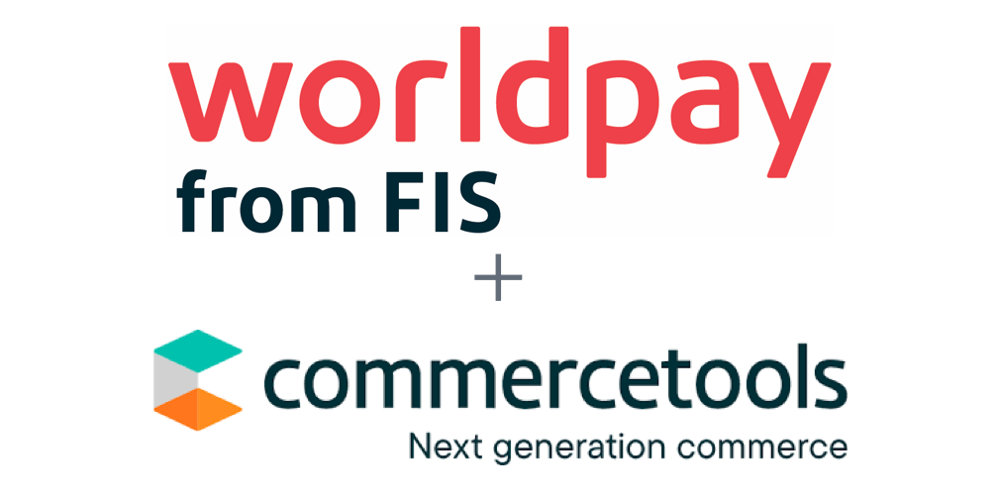
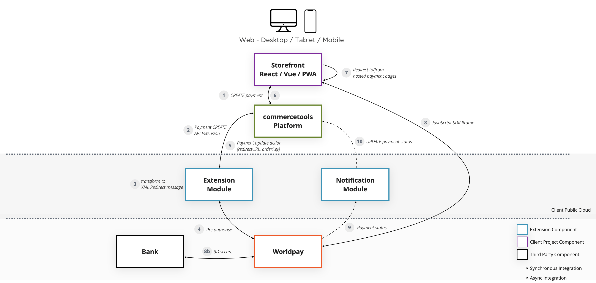
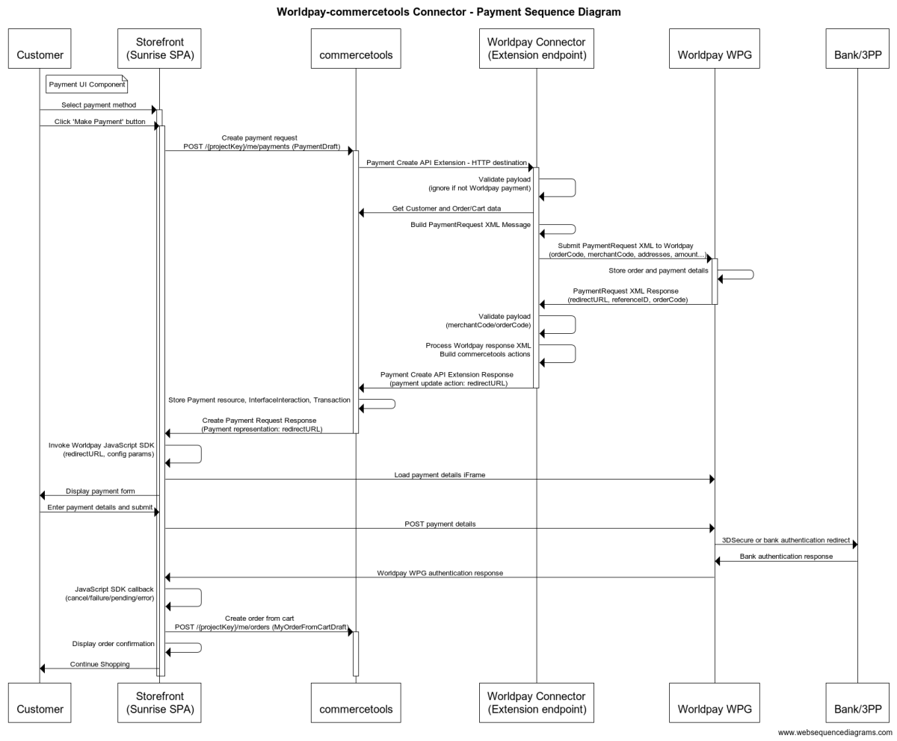

# Worldpay-commercetools Connector

The Worldpay-commercetools connector module provides integration between commercetools and the Worldpay Worldwide Payment Gateway (WPG) with support for the following payment use cases:

- [Worldpay Worldwide Payment Gateway](https://developer.worldpay.com/docs/wpg) (WPG) integration using the XML API
- Worldpay WPG [Hosted Payment Pages](https://developer.worldpay.com/docs/wpg/hostedintegration) integration (PCI DSS compliant)
- Payment Authorisation, Authentication and Capture flows configurable across a large number of global payment types
- [Payment Status Notification](https://developer.worldpay.com/docs/wpg/manage) updates and handling of Payment Cancel and Refund flows in a commercetools context
- 3DS Flex for Payment Services Directive 2 (PSD2) / Strong Customer Authentication compliance
- Risk Management Module integration
- Worldpay [FraudSight](https://developer.worldpay.com/docs/wpg/fraudsightglobal/fraudsighthosted) screening integration

In addition the module source code repository provides:

- Infrastructure-as-code cloud deployment templates for easy provisioning into a client's cloud infrastructure
- A suite of unit and integration test components

The [commercetools Sunrise SPA repository](https://github.com/commercetools/sunrise-spa) has been forked and extended to add:

- Sample payment creation / checkout flow
- Reference React UI Components using the Worldpay JavaScript SDK and the recommended iframe hosted payment pages approach

## Integration Approach

The integration approach leverages [commercetools API Extensions](https://docs.commercetools.com/api/projects/api-extensions) to register an extension and transform payment create/update API calls via the Worldpay Connector module between commercetools and the Worldpay payment gateway. The Connector has modules for handling both the synchronous payment request invocations and asynchronous payment status notifications from Worldpay back to commercetools.

## Payment Sequence Flow

The following diagram shows the logic flow between commercetools and Worldpay via the Worldpay-Commercetools Connector module.

For full details of the connector :

- [User Guide](docs/USER_GUIDE.md)
- [Developer Guide](docs/DEVELOPER_GUIDE.md)
- [Deployment Guide](docs/DEPLOYMENT_GUIDE.md)

## Extensibility

The Connector is designed to be configurable and easily extensible. It is composed of Node.js applications that can be deployed either cloud natively as serverless functions in AWS or other public cloud, or on any infrastructure via Docker containers.

- [Developer Guide](docs/DEVELOPER_GUIDE.md)
