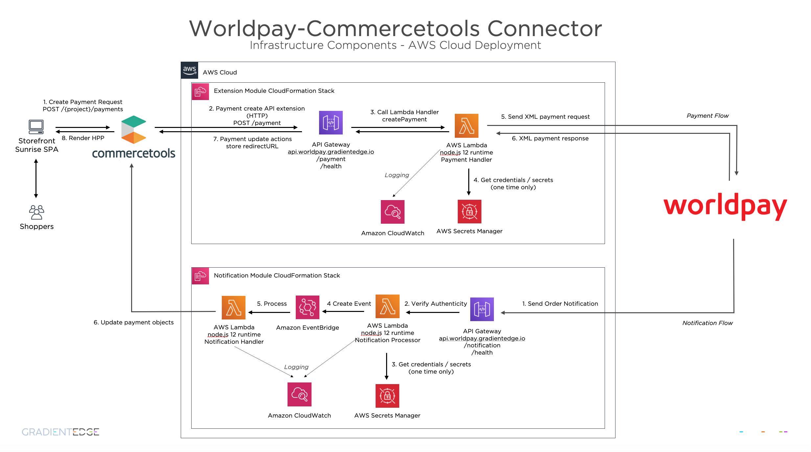

# Worldpay-commercetools Connector - Deployment Guide

This guide details how to deploy the connector within a production environment.

## Bootstrapping commercetools entities

To configure commercetools to invoke the connector extension endpoint, the API extensions need to be configured within your commercetools sandbox. Additionally, there are a number of resource type extensions specific to the Worldpay payment types.

| Name                               | commercetools extension type | Description                                                                                         |
|------------------------------------|------------------------------|-----------------------------------------------------------------------------------------------------|
| Payment Extension                  | API Extension                | API extension for the create/update payment actions                                                 |
| Worldpay Payment Type              | Custom Type                  | Payment resource custom fields for Worldpay specific data                                           |
| Payment Interface Interaction      | Custom Type                  | Worldpay payment interface interaction data (create payment request from commercetools to Worldpay) |
| Customer's tokenised cards         | Custom Type                  | Worldpay tokenised credit card, stored in a custom type in the commercetools customer profile       |
| Notification Interface Interaction | Custom Type                  | Worldpay notification interface interaction data (callback from Worldpay)                           |

Types are defined in the `infrastructure/resources/commercetools/types` folder. These custom types can be defined in commercetools, either by integrating them into your Infrastructure As Code (IAC) solution, or by manually uploading them using the [Commercetools Postman collection](https://docs.commercetools.com/sdk/postman). In postman, navigate to `Commercetools > Project > Types > Create Type` and paste each of the type files from the resource folder.

In `infrastructure/resources/commercetools/api-extension/worldpay-payment-api-extension.json` the API extension can be found, to use as template for defining the end-point for payment object Create/Update events. Before using this file, edit the `url` property. Assign it the end-point of your payment module. After this, upload it to commercetools using the postman project `Commercetools > Project > Extensions > Create Extension`.

The notification endpoint does not need configuration in commercetools. The payment and notification endpoints need deployment with sufficient settings to allow access to commercetools (environment variables `WORLDPAY_CONNECTOR_*`) and correct scopes for the access token.

## Client scopes

### Deployment 

To deploy the extensions and types into commercetools, the following client scopes are required:

* `manage_types`: for adding the custom types
* `manage_extensions`: to define the payment endpoint that commercetools invokes

### Runtime

While the connector is active, the following scopes are required. For security, we recommend the minimal scope which is independent of other tools/applications that access commercetools:

* `manage_orders`: updates order status upon authorisation of a payment
* `manage_customers`: updates the customer's tokenised cards in combination with hosted payment where customer request their card to be stored
* `manage_payments`: updates commercetools payments based on Worldpay notifications

Note that these scopes are never to be shared with end customers, as they are too powerful.

## Extension & Notification Endpoints

The Worldpay-Commercetools connector provides 2 x endpoints that need to be integrated within a commercetools environment.

- An API extension HTTP endpoint that is invoked by the commercetools platform whenever a create/update API call is made for a Payment resource. This is secured via HTTPS and HTTP authentication with a shared token configured within the connector and the bootstrapped API extension configuration.
- An API Notification endpoint that is invoked by the Worldpay Payment Gateway to send asynchronous updated regarding payment status changes. The connector processes these notification messages and updates the relevant entities within commercetools. This endpoint is secured via HTTPS with Mutual TLS Certificate Authentication (mTLS)

## Deployment options

The module consists of a single stateless node.js application that supports both of these endpoints. It can be configured to respond to one or both of these endpoint calls. See [docker container README.md](../application/apps/container/docker/README.md) for more details on how to build the docker image.

Within a production environment, the connector can be deployed as a serverless function (AWS Lambda / Azure Function / GCP Cloud Function), with an API Gateway to invoke the function. Alternatively, it can be deployed as a docker container and run within your container management tooling of choice.

Reference infrastructure-as-code is provided for an AWS deployment using the [AWS Cloud Development Kit (CDK)](https://docs.aws.amazon.com/cdk/latest/guide/home.html) framework. This contains sample stacks for both a serverless (AWS Lambda) deployment or a containerised Docker deployment, using Fargate/ECS container management.

_NB: You only need to choose and deploy one of these options - both are provided as reference_

The following diagrams shows the reference infrastructure for an AWS serverless deployment of the Worldpay-Commercetools connector module.

Certain payment methods require a redirect to a 3rd party site (i.e PayPal, iDEAL bank, Klarna). The customer's browser will leave the Storefront Sunrise SPA, and interact with the 3rd party. Upon success, failure or cancellation of the interaction with the 3rd party, the browser returns to Storefront Sunrise SPA with the payload to complete the transaction.
Adding that payload to the payment object in Commercetools finalised the transaction.

### AWS Serverless Infrastructure CDK Constructs

All of the AWS infrastructure components are available in the `infrastructure/aws` folder.

The following 2 steps enable you to deploy the Worldpay Commercetools Connector

#### 1. AWS CDK Configuration

Before deploying the stack, update the configuration values within the `cdk.json` file. Many of the details of the AWS environment can be modified such as memorySize and timeout for the function - these parameters are self-evident from the `cdk.json` file.
The key properties that need to be configured are as follows:

- `domain` - the domain that the API will be deployed to - i.e. _mycompany.com_
- `extensionSubdomain` - the subdomain that the commercetools API extension will interact with - i.e. _api_ - this will be prepended to the `domain` property when configuring the API Gateway - i.e. `api.mycompany.com`
- `notificationSubdomain` - the subdomain that the Worldpay WPG notifications will interact with - i.e. _api-secure_ - this will be secured with Mutual TLS Certification Authentication using the Worldpay root certificates, and hence must be a different subdomain as the [AWS Mutual TLS configuration](https://docs.aws.amazon.com/apigateway/latest/developerguide/rest-api-mutual-tls.html) is made against a REST API custom domain name.
- `stage` - the CDK stage - i.e. dev/tst/prd - the stage declared will be appended to the subdomain for all stages other than `prd` - i.e. `stage=dev` would create the API at `api-dev.mycompany.com`
- `certificateId` - ID of an SSL certificate that has been created within [AWS Certificate Manager](https://aws.amazon.com/certificate-manager/) for the `domain`
- `secretNames` - comma-separated list of one or more secrets defined within [AWS Secrets Manager](https://aws.amazon.com/secrets-manager/) containing the commercetools and Worldpay credentials. These will be combined within any environment variables defined within Lambda/Docker config and made available to the node.js runtime as env vars. See the [user guide](USER_GUIDE.md) for details of the values that must be configured.

#### 2. Synthesize and deploy the stack

The `infrastructure/aws/lib` folder contains a number of TypeScript CDK constructs and stacks for all of the required infrastructure components, including Lambda function, IAM roles, API Gateway REST API and custom domain, Route53 DNS hosted zones, CloudWatch logs, S3 bucket for Worldpay mTLS certificate.

3 x stacks are available:

- `worldpay-connector-certificate` - contains an S3 bucket with a deployment of the [Worldpay mTLS root certificate](https://developer.worldpay.com/docs/wpg/manage#authenticating-the-sender)
- `worldpay-connector-lambda-extension` - stack containing all AWS infrastructure required for a serverless scalable Lambda deployment of the connector extension. This stack has a dependency on the `worldpay-connector-certificate` stack.
- `worldpay-connector-lambda-notification` - stack containing all AWS infrastructure required for a serverless scalable Lambda deployment of the connector notification. This stack has a dependency on the `worldpay-connector-certificate` stack.

The stack names will have the `stage` appended i.e. `worldpay-connector-certificate-dev`

You can choose whichever of the lambda or docker stacks suits your infrastructure guidelines.

To deploy the AWS CloudFormation stack for the `dev` stage;

All Stacks
- `npm run deploy -- --all --context stage=dev --context account=1234567890` 

Individual Stacks
- `npm run deploy -- worldpay-connector-certificate-dev --context stage=dev --context account=1234567890`
- `npm run deploy -- worldpay-connector-lambda-extension-dev --context stage=dev --context account=1234567890`
- `npm run deploy -- worldpay-connector-lambda-notification-dev --context stage=dev --context account=1234567890`

## Apple Pay certificates

Certificates for Apple Pay that are deployed with the lambda:

* Private key to sign a payment session (merchant.key.decrypted)
* Certificate for payment session (merchant_id.pem)

Both files are expected to be in ASCII format. See [README.md](../application/certs/README.md) for details.
