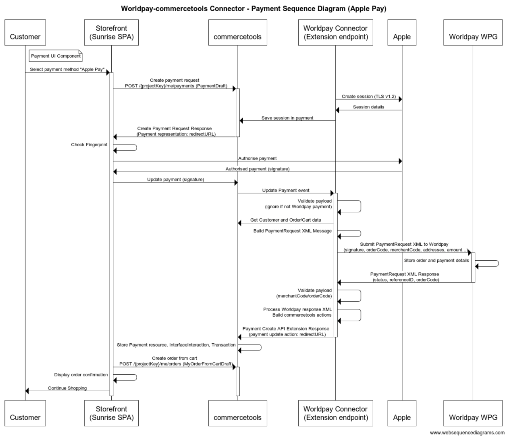

# Worldpay-commercetools Connector - Developer Guide

## Package overview

The package housing the code that powers the connector can be found in the `/application/connector` directory.
It contains the code that's executed in response to either a request from commercetools via the
Worldpay connector extension, or when a notification request comes in from Worldpay.

## Configuration

There are a number of configuration parameters required in order to run the connector. Please see the
[User Guide](./USER_GUIDE.md) documentation for details on what's required.

## pnpm

The connector consists of multiple packages, which are built using the multi-package JavaScript package manager [pnpm](http://pnpm.io).

You would not generally be expected to execute any of the pnpm command found in the `package.json` file unless
you are customising the implementation. The command list is straightforward (more commands exist but are left out
for clarity):

```
"scripts": {
    "validate": "npm run prettier && npm run lint && npm test",
    "package:aws": "pnpm package:aws-lambda-payment && pnpm package:aws-lambda-notification",
    "package:azure": "pnpm package:azure --filter @gradientedge/wcc-tasks",
    "package:docker": "esbuild apps/container/docker/src/index.js --bundle --platform=node --target=node14 --outdir=../.artifacts/docker-container",
    "start:aws": "cd tools/serverless && pnpm start"
}
```

#### pnpm validate

This will validate code formatting and execute Jest ([https://jestjs.io/](https://jestjs.io/)) using the `jest.config.js` file found in the root of this package,
which will ultimately run the unit and integration tests found in the `__tests__` folder. We highly recommend
expanding on the existing tests if making your own customisations.

#### pnpm package:*

Several package scripts exist to package the application for different deployment methods. They form the starting point for integration into your
own CI/CD pipelines.

#### pnpm start:aws

Runs `pnpm start` in folder `application/tools/serverless` to start a local development server. Even if you do not deploy
the connector into AWS, this is the most convenient way to develop locally. Once started, a long-lived server process
for the payment extension and notification is started. You can POST messages to `https://localhost:5000/payment` and `https://localhost:5000/notification`.
This server will read its configuration from a `.env` file. The `.env.template` serves as a template to create your own
configuration. See [configuration parameters](./USER_GUIDE.md) for details on the parameters.

Note that before the connector can work successfully with commercetools, additional types and configuration is required, which is described in the [Deployment guide](./DEPLOYMENT_GUIDE.md).

## Technical deep dive

There are a number of key technical concepts that are useful to understand in order get a comprehensive
view of the technical implementation. See the links below for separate document on each appropriate area:

- [Creating a connector](../application/packages/connector/README.md) - a closer look at the `Connector.js` package
- [PaymentProcessor](../application/packages/connector/src/processor/payment/README.md) - the class responsible for handling requests from
  our commercetools API extension
- [NotificationProcessor](../application/packages/connector/src/processor/notification/README.md) - the class responsible for handling notification
  requests sent from Worldpay
- [CommercetoolsBootstrapper](../application/packages/connector/src/commercetools/README.md) - a closer look at how the bootstrapping process works


## Apple Pay certificates

Apple Pay uses certificates to secure the communication between the merchant and Apple. To this end, certificates are required. See [Worldpay documentation](https://developer.worldpay.com/docs/wpg/mobilewallets/applepay),
[Apple Pay documentation](https://developer.apple.com/documentation/apple_pay_on_the_web) and the [Apple Pay certificates README.md](../application/certs/README.md). Once set up, you are ready to integrate with Apple Pay (direct).

You can verify Apple Pay locally, but when you don't have a (local) domain registered with Apple, the process will break at the point where a user authenticates the payment.
Step "Create session (TLV v1.2)" in the sequence diagram below requires the certificates to work. This step can be executed from a local environment.
Step "Check Fingerprint" will fail however, because the communication with Apple does not come from the domain registered at Apple. You need to deploy to
the site(s) registered with Apple for the "Check Fingerprint" step to succeed. 

**Note**: For brevity, any communication between Apple and Worldpay WPG with the bank has been omitted. Notifications on progress will be sent by Worldpay, for instance to inform about a refused or accepted transaction.



## Postman collection

To help with extension and testing the payment and notification endpoints locally, a Postman collection is available in `infrastructure/resources/postmanCollection`. 
It contains a number of example payment Create/Update messages from commercetools as well as a number of notifications from Worldpay.

# Recommendations for implementation

## Middleware

When implementing this connector in your own application, we recommend using a middleware application in between the storefront and commercetools.
This architecture will allow the following:

* Capturing of the customer's IP address for inclusion in messages to Paypal and other direct payment methods. Without middleware, sending the customer's IP address from the browser is impossible. In case you do not have middleware, there are commercial services that allow you to obtain it via a request to their service, returning a response containing the IP address they received the call from.
* Direct calls to services instead of having to go through commercetools for all calls. This brings the benefit of only having to react on the "Create" event of a payment in commercetools, dropping the "Update" event from the logic. Updates currently happen for various reasons (notifications, Apple Pay 2nd step, ...) and complicate the logic to determine when to react on an event. Examples of logic to move out of the connector into the middleware:
    * Obtain the collection of supported payment methods in a country
    * Start an Apple Pay session

## Storefront

The storefront will have to implement the following logic:

1. Select a payment method. Here we distinguish:
   1. Hosted payment method(s), where the customer is redirected to Worldpay (in an IFrame) and selects the payment method they want to use.
   2. Tokenised cards: the user may have one or more cards stored against their profile, which can be used for payment.
   3. Direct payment method(s): the Paypal, Klarna (pay now, later or in instalments), iDEAL, Apple Pay and/or Google Pay payment methods.
2. For Google Pay, see [Google Pay for the Web](https://developers.google.com/pay/api/web/overview) for details on how to display the Google Pay button.
3. [Apple Pay documentation](https://developer.apple.com/documentation/apple_pay_on_the_web) explains how and when to display the Apple Pay button.
4. To discover the payment methods available in a country, use the [Worldpay Payments Options Inquiry](https://developer.worldpay.com/docs/wpg/manage/inquiryrequests#payment-options-inquiry) API.
5. For iDEAL, the user must select the bank they want to use

### Payloads for attribute `paymentData`

The `paymentData` attribute of the Commercetools `payment` object will hold the data to start a payment session. The content is a stringified JSON object and it differs per payment method:

* Hosted payment: `{ method: 'card', ip: '127.0.0.1' }`
* Tokenised credit card: attribute method with value `tokenisedCard`, the user's IP address and additionally some of the properties that Worldpay provided for a tokenised card `{ method: 'tokenisedCard', ip: '127.0.0.1', paymentTokenId: '9950075050672060107',tokenEventReference: 'Order_6028c21f_3b1f_4155_a799_92ef98f74e2f',paymentTokenExpiry: '2022-03-31T00:00:00.000Z',cardBrand: 'VISA',cardSubBrand: 'VISA_CREDIT',issuerCountryCode: 'N/A',obfuscatedPAN: '4444********1111',bin: '444433' }`
* Klarna:
  * Pay now: `{ method: 'klarnaPayNow', ip: '127.0.0.1' }`
  * Pay later: `{ method: 'klarnaPayLater', ip: '127.0.0.1' }`
  * Pay pay in instalments: `{ method: 'klarnaPaySliced', ip: '127.0.0.1' }`
* Paypal: `{ method: 'payPal', ip: '127.0.0.1' }`
* iDEAL: `{ method: 'iDEAL', shopperBankCode: 'BUNQ', ip: '127.0.0.1' }`. For a list of possible bank codes and their names, see [Worldpay iDEAL](https://developer.worldpay.com/docs/wpg/apms/ideal).
* Apple Pay requires two interactions from the storefront:
    1. Create a session: `{ ...event, method: 'applePay', validationURL: event.validationURL }`, where `event` is the event that Apple Pay emits in the `session.onvalidatemerchant` function. See the code snippet below for more details.
    2. Update the payment after user authorisation: `{ event.payment }`, with `event` emitted the Apple Pay `onpaymentauthorized` function.
* Google Pay: `{ method: 'googlePay', ...paymentData}`, where `paymentData` is the data produced by Google Pay's `loadPaymentData` function.

#### Apple Pay code snippet

Below you find a snippet from the Sunrise store with support of direct Apple Pay payment via Worldpay
```javascript
   // Vue's method definitions, including the useApplePay(), which is invoked once the user
   // selects the Apple Pay payment method: 
   methods: {
    async useApplePay() {
        const country = this.me.activeCart.country
        const totalAmount = this.me.activeCart.totalPrice.centAmount / 100
        const currencyCode = this.me.activeCart.totalPrice.currencyCode
        const request = {
            countryCode: country?.toUpperCase() || 'GB',
            currencyCode: currencyCode,
            // Only use the networks supported by WorldPay
            supportedNetworks: ['visa', 'masterCard', 'amex', 'discover'],
            merchantCapabilities: ['supports3DS'],
            total: {label: process.env.VUE_APP_WORLDPAY_MERCHANT_NAME, amount: totalAmount},
        }
        const session = new ApplePaySession(3, request);
        session.onvalidatemerchant = async event => {
            // Start a new merchant session. For security reasons, never on the client, instead
            // call our own server to request a new merchant session.
            const input = {
                ...event,
                method: 'applePay',
                validationURL: event.validationURL,
            }
            const apPayment = await this.createPayment(input)

            if (apPayment) {
                // Store object for completed phase
                this.payment = apPayment
                const merchantSession = JSON.parse(apPayment?.custom?.fields?.paymentData)

                if (merchantSession && !merchantSession.error) {
                    // Success, continue with the session
                    session.completeMerchantValidation(merchantSession);
                    return;
                }
            }
            session.abort()
            this.displayPaymentFailure()
        };

        // eslint-disable-next-line no-unused-vars
        session.onpaymentauthorized = event => {
            const result = event?.payment
            // Send to Worldpay
            this.updatePayment(result)
            session.completePayment({
                // eslint-disable-next-line no-undef
                "status": ApplePaySession.STATUS_SUCCESS
            });
            this.$emit('success')
        };

        // eslint-disable-next-line no-unused-vars
        session.oncancel = event => {
            // Payment cancelled by WebKit
            this.errorMessage = JSON.stringify(event)
            this.displayPaymentFailure()
        };

        session.begin();
    }
}
```